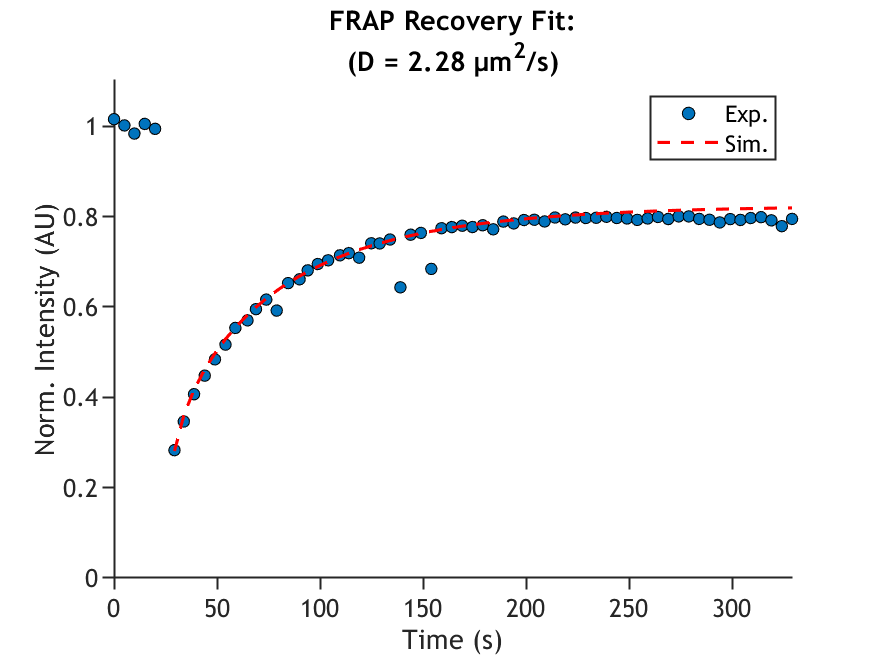

<!--
*** Thanks for checking out the SLB_FRAP_2_Diffusion-Template. If you have a suggestion
*** that would make this better, please fork the repo and create a pull request
*** or simply open an issue with the tag "enhancement".
*** 
*** I imagine a world where scientific knowledge provides solutions for every health challenge, enabling everyone to live with autonomy, freedom, and well-being.
*** I created this project so that I might streamline taking raw microscopy data in my PhD and convert that in biological insights that might aid understanding the next generation of engineered T cell immunotherapies.
*** I hope this could be useful to a few future scienctist in whatever pursuit they are taking on. 
*** I would be overjoyed to help enable you to make discoveries and share knowlegde with humanity.
-->

<!-- PROJECT LOGO -->   
    <h3 align="center">Supported Lipid Bilayer FRAP data to Diffusion Coefficient (SLB_FRAP_2_Diffusion)</h3> 
 A MATLAB-based workflow for estimating SLB mobility   <a href="https://github.com/your_username/SLB_FRAP_2_Diffusion"><strong>Explore the docs »</strong></a>     <a href="https://github.com/kscrudders/SLB_FRAP_2_Diffusion/issues">Report Bug</a> · <a href="https://github.com/kscrudders/SLB_FRAP_2_Diffusion/issues">Request Feature</a> 
 
 <!-- TABLE OF CONTENTS --> 
 
Table of Contents
 <ol> <li><a href="#about-the-project">About The Project</a></li> <li><a href="#built-with">Built With</a></li> <li><a href="#getting-started">Getting Started</a> <ul> <li><a href="#prerequisites">Prerequisites</a></li> <li><a href="#installation">Installation</a></li> </ul> </li> <li><a href="#usage">Usage</a></li> <li><a href="#roadmap">Roadmap</a></li> <li><a href="#contributing">Contributing</a></li> <li><a href="#license">License</a></li> <li><a href="#contact">Contact</a></li> <li><a href="#acknowledgments">Acknowledgments</a></li> </ol> 
 <!-- ABOUT THE PROJECT -->
About The Project
SLB_FRAP_2_Diffusion is a workflow for generating an estimated diffusion coefficient for supported lipid bilayers labeled with a lipophilic dye. It helps users:

Import image data and metadata for a single fluorescent channel.
Perform shade and bleaching corrections.
Define a FRAP regions of interest (ROI).
This script is currently optimized for use with Nikon microscopes (.nd2 image files). 

(<a href="#readme-top">back to top</a>)
 <!-- BUILT WITH -->

Built With Matlab and Matlab Toolboxs:
* Matlab vR2024b
* Curve Fitting Toolbox
	
External Supporting Matlab scripts:
* bfopen - https://www.openmicroscopy.org/bio-formats/downloads/
* ND2info - https://www.mathworks.com/matlabcentral/fileexchange/73271-nd2-reader

(<a href="#readme-top">back to top</a>)
 <!-- GETTING STARTED -->

Getting Started 

These instructions will guide you in preparing your local environment to run SLB_FRAP_2_Diffusion.m.

Prerequisites:
* MATLAB (R2019b or newer recommended)
* Above toolboxs
* Above external matlab scripts 
* Shade Image data
* Gain calibration data for EMCCD camera (if desired)

Installation:
* Clone the repository:
* sh
* Copy
* Edit
* git clone https://github.com/kscrudders/SLB_FRAP_2_Diffusion.git

Add to MATLAB path:
* Open MATLAB.
* Go to Home > Set Path > Add with Subfolders and select the cloned folder.

(<a href="#readme-top">back to top</a>)
 <!-- USAGE EXAMPLES -->

Usage:
* In MATLAB, open SLB_FRAP_2_Diffusion.m.
* Set file paths under Section_01 (Import Data). Adjust data_dir and save_data_in_this_folder to your local directories where raw image data and output will be stored.
Adjust acquisition parameters:
* Define channel imaging frequency, and select gain, shade, and/or bleach correction setting, and so on in Sections_02–03.
Select and edit ROIs, to isolate cells.
* Remaining sections should be executed one by one, so you can inspect intermediate outputs and fix any issues.
Export: The script will produce a final figure, containing FRAP recovery curve fit and estimated diffusion coefficient.
* For step-by-step details, see the comments within the script. And/or walk through example on YouTube: [WIP]

<!-- PROJECT LOGO -->   
      

(<a href="#readme-top">back to top</a>)
 <!-- ROADMAP -->

## Roadmap

- [ ] More advanced options for the FRAP recovery fit - https://onlinelibrary.wiley.com/doi/10.1111/j.1365-2818.2009.03347.x
- [ ] Add Changelog as updates roll in

See the [open issues](https://github.com/kscrudders/SLB_FRAP_2_Diffusion/issues) for a full list of proposed features (and known issues).

(<a href="#readme-top">back to top</a>)
 <!-- CONTRIBUTING -->

Contributing: 

Contributions make this script more robust and easier to use. If you have suggestions:
* Fork the Project
* Create your Feature Branch (git checkout -b feature/YourFeature)
* Commit your Changes (git commit -m 'Added an awesome feature')
* Push to the Branch (git push origin feature/YourFeature)
* Open a Pull Request

(<a href="#readme-top">back to top</a>)
 <!-- LICENSE -->

License: 

This project is distributed under GNU Genereal Public License. 

See LICENSE.txt for details.

(<a href="#readme-top">back to top</a>)
 <!-- CONTACT -->
Contact 

Kevin Scrudders – kscrudders@gmail.com

Project Link: https://github.com/kscrudders/SLB_FRAP_2_Diffusion

(<a href="#readme-top">back to top</a>)
 <!-- ACKNOWLEDGMENTS -->

Acknowledgments
* The lab of Dr. Shalini T. Low-Nam
* The ever excellent MathWorks Documentation
* Tsay and Jacobson's 1991 Biophysics Journal article - Spatial Fourier analysis of video photobleaching measurements - https://doi.org/10.1016/s0006-3495(91)82061-6
* Blurmenthal et. al.; Levi A. Gheber lab 2015 Science Report - Universal Approach to FRAP Analysis of Arbitrary Bleaching Patterns - https://doi.org/10.1038/srep11655
* The code was developed in 2025. Some of the code was drafted using ChatGPT. All code was reviewed, stress tested, and approved by me, Kevin.

(<a href="#readme-top">back to top</a>)

